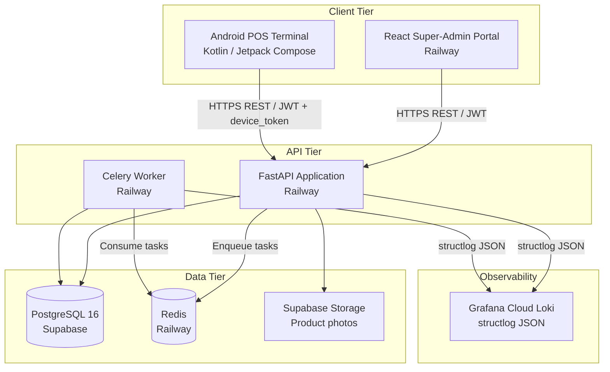
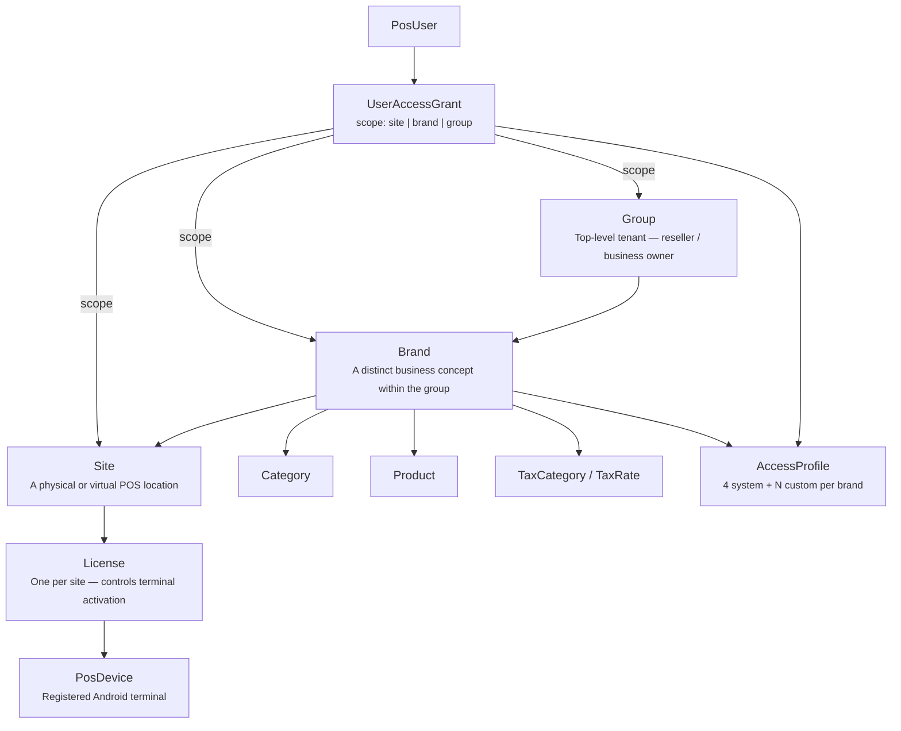
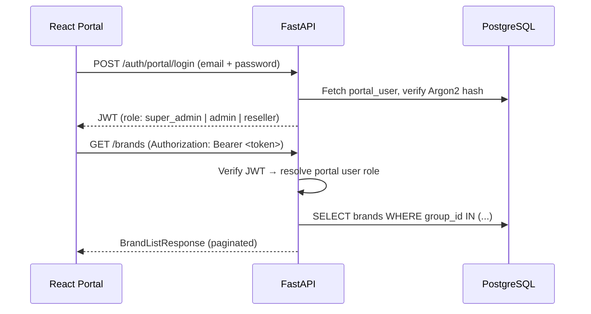
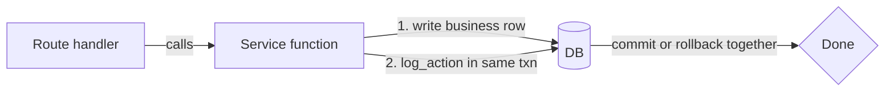

# ZedRead POS — Architecture Overview

> **Keep README.md in sync.** When the tech stack, hosting, or deployment topology changes, update the tech stack table in `README.md` at the same time as this file.

## System Summary

ZedRead is a multi-tenant Point-of-Sale platform composed of three independent tiers that communicate exclusively through the REST API:

| Tier | Technology | Hosting |
|------|-----------|---------|
| **Backend API** | Python 3.12 · FastAPI · SQLAlchemy (async) · PostgreSQL 16 | Railway |
| **Super-Admin Portal** | React 19 · TypeScript · Vite · Tailwind CSS 4 · TanStack Query | Railway |
| **Android POS App** | Kotlin · Jetpack Compose · Hilt · Retrofit · Room | Sideloaded APK / Play Store |

Supporting infrastructure: Supabase (PostgreSQL managed + Storage), Celery + Redis (background jobs), Grafana Cloud Loki (structured log aggregation).

---

## High-Level Architecture



---

## Multi-Tenant Hierarchy

Every piece of data in the system is scoped to a node in the three-level tenant tree. The hierarchy is strictly enforced: a Brand cannot exist without a Group, and a Site cannot exist without a Brand.



**Scope rules:**
- Catalog (products, categories, tax) is **brand-scoped** — shared across all sites in a brand.
- Invoices are **site-scoped** — each site has its own transaction history.
- `UserAccessGrant.scope` controls whether a user's permission covers a single site, all sites in a brand, or all brands in a group.

---

## Request Data Flow

### Portal Request (super-admin managing hierarchy)



### POS Request (cashier completing a sale)

```mermaid
sequenceDiagram
    participant T as Android Terminal
    participant API as FastAPI
    participant DB as PostgreSQL

    T->>API: POST /auth/pos/pin/verify (email + PIN + device_token)
    API->>DB: Verify user_pin hash, check device active + license active
    API-->>T: JWT (user_id, site_id, brand_id, profile permissions)

    T->>API: POST /invoices (site context from JWT)
    API->>DB: INSERT invoices (status=draft)
    API-->>T: InvoiceResponse

    T->>API: POST /invoices/{id}/line-items (product_id, quantity)
    API->>DB: Resolve product + site overrides + tax
    API->>DB: INSERT invoice_line_items (snapshot all price/tax fields)
    API->>DB: UPDATE invoices totals
    API-->>T: InvoiceLineItemResponse

    T->>API: POST /invoices/{id}/pay (method, amount_cents)
    API->>DB: INSERT payments; check sum >= total_cents
    API->>DB: UPDATE invoices status=paid, paid_at=now()
    API->>DB: INSERT audit_logs (action=invoice.paid)
    API-->>T: InvoiceResponse (status: paid)
```

---

## Authentication Architecture

Two completely separate auth flows share the same JWT infrastructure but use different secrets and claims.

| Aspect | Portal Auth | POS Auth |
|--------|------------|---------|
| **Credential** | Email + password (Argon2) | Email + password → sets PIN; subsequent logins use email + PIN |
| **Endpoint** | `POST /auth/portal/login` | `POST /auth/pos/login` (full), `POST /auth/pos/pin/verify` (fast switch) |
| **JWT claims** | `user_id`, `role` (super_admin/admin/reseller) | `user_id`, `site_id`, `brand_id`, `group_id`, `profile_id`, `permissions` |
| **Device check** | None | `device_token` must be active; license must be active |
| **PIN storage** | N/A | Argon2 hash in `user_pins`; 4–6 digits |
| **Purpose** | Management operations | Fast user switching at the terminal |

---

## Audit Logging Architecture

Every state-changing operation writes an `AuditLog` row **in the same database transaction** as the business change. If the business write rolls back, the audit row rolls back with it.



Key `audit_logs` columns:
- `actor_type`: `user` or `system` (Celery jobs)
- `actor_email`, `actor_name`: snapshotted at write time — preserved even after user renames
- `action`: dot-separated constant from `app/constants/audit_actions.py` (e.g. `invoice.paid`)
- `before_state` / `after_state`: JSONB snapshots of the entity before and after the change
- `request_id`: correlated to the HTTP request via `X-Request-ID` middleware

---

## Background Jobs (Celery)

| Job | Trigger | What it does |
|-----|---------|-------------|
| License expiry check | Nightly (cron) | Scans `licenses` where `expires_at < now()` and status != expired; transitions to `expired`; writes audit row with `actor_type=system` |

The Celery worker reads from the same PostgreSQL database and shares all service functions with the API process.

---

## Technology Stack

### Backend

| Package | Version | Role |
|---------|---------|------|
| FastAPI | 0.115.5 | HTTP framework, OpenAPI generation |
| SQLAlchemy | 2.0.36 | Async ORM |
| asyncpg | 0.30.0 | Async PostgreSQL driver |
| Alembic | 1.14.0 | Schema migrations |
| Pydantic v2 | 2.10.3 | Request/response validation |
| python-jose | Latest | JWT encode/decode |
| argon2-cffi | Latest | Password and PIN hashing |
| structlog | 24.4.0 | Structured JSON logging |
| Celery | 5.4.0 | Background task queue |
| Redis | 7-alpine | Celery broker |
| supabase-py | 2.10.0 | Storage uploads |
| resend | 2.4.0 | Transactional email |

### Portal

| Package | Version | Role |
|---------|---------|------|
| React | 19.2.5 | UI framework |
| TypeScript | ~6.0.2 | Type safety |
| Vite | 8.0.10 | Build tool |
| Tailwind CSS | 4.2.4 | Utility-first styling |
| React Router | 7.14.2 | Client-side routing |
| TanStack Query | 5.100.9 | Server state, caching, retries |
| axios | 1.16.0 | HTTP client with interceptors |

### Android (Stage 13–14)

| Library | Role |
|---------|------|
| Jetpack Compose | Declarative UI |
| Hilt | Dependency injection |
| Retrofit | HTTP client |
| Room | Local SQLite cache |
| Kotlin Coroutines / Flow | Async state management |

---

## Deployment Topology

```
Git push → GitHub
  ├─► Railway (auto-deploy)
  │     ├─ FastAPI (uvicorn, Dockerfile)
  │     │    └─ alembic upgrade head on startup
  │     └─ Celery worker (same image, different CMD)
  └─► Railway (auto-deploy)
        └─ React SPA (pos-portal/)

Supabase (external)
  ├─ PostgreSQL 16 (production DB)
  └─ Storage (product photos)

Grafana Cloud Loki (external)
  └─ structlog JSON → Loki push endpoint
```
