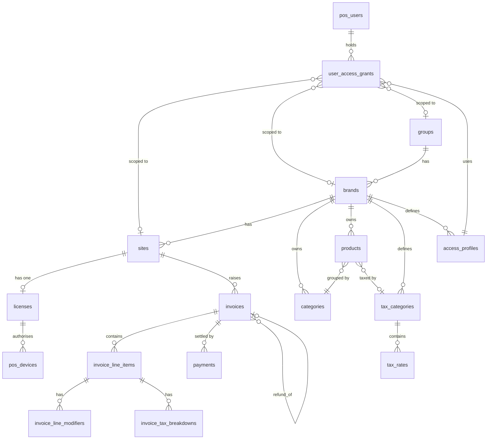

# ZedRead POS — Data Model

All monetary columns are stored as `BIGINT` in cents (e.g. `1299` = $12.99). All primary keys are `UUID`. Timestamps are `TIMESTAMPTZ` (UTC).

---

## Domain Map



---

## Tables by Domain

### Tenant Hierarchy

#### `groups`
Top-level tenant — typically a reseller or business owner.

| Column | Type | Notes |
|--------|------|-------|
| `id` | UUID PK | |
| `ref_id` | VARCHAR | Human-readable ID, e.g. `GRO-000001` |
| `name` | VARCHAR(255) | |
| `status` | VARCHAR(20) | `active` \| `suspended` |
| `created_at` | TIMESTAMPTZ | |
| `updated_at` | TIMESTAMPTZ | |

#### `brands`
A distinct business concept (e.g. "Burger Barn") within a group. The catalog (products, categories, tax) lives at this level.

| Column | Type | Notes |
|--------|------|-------|
| `id` | UUID PK | |
| `group_id` | UUID FK → groups | |
| `ref_id` | VARCHAR | e.g. `BRA-000001` |
| `name` | VARCHAR(255) | |
| `status` | VARCHAR(20) | `active` \| `suspended` |
| `created_at` | TIMESTAMPTZ | |
| `updated_at` | TIMESTAMPTZ | |

#### `sites`
A physical or virtual POS location within a brand.

| Column | Type | Notes |
|--------|------|-------|
| `id` | UUID PK | |
| `brand_id` | UUID FK → brands | |
| `ref_id` | VARCHAR | e.g. `SIT-000001` |
| `name` | VARCHAR(255) | |
| `status` | VARCHAR(20) | `active` \| `suspended` |
| `created_at` | TIMESTAMPTZ | |
| `updated_at` | TIMESTAMPTZ | |

---

### Licensing & Devices

#### `licenses`
One record per site. Controls whether a POS terminal is authorised to operate.

| Column | Type | Notes |
|--------|------|-------|
| `id` | UUID PK | |
| `site_id` | UUID FK → sites | UNIQUE — one license per site |
| `plan` | VARCHAR(50) | License tier |
| `status` | VARCHAR(20) | `active` \| `expired` \| `disabled` |
| `monthly_fee_cents` | BIGINT | |
| `starts_at` | TIMESTAMPTZ | |
| `expires_at` | TIMESTAMPTZ | Checked nightly by Celery job |
| `created_at` | TIMESTAMPTZ | |
| `updated_at` | TIMESTAMPTZ | |

**Design note:** The nightly Celery job uses `actor_type='system'` in audit_logs because no human triggers the expiry transition.

#### `pos_devices`
Registered Android terminals. A device can only be registered when its site's license is active.

| Column | Type | Notes |
|--------|------|-------|
| `id` | UUID PK | |
| `site_id` | UUID FK → sites | |
| `license_id` | UUID FK → licenses | Checked for active status at registration |
| `device_name` | VARCHAR(255) | Human-readable label |
| `device_token` | VARCHAR(255) UNIQUE | Token sent with every POS API call |
| `is_active` | BOOLEAN | False = deregistered |
| `registered_at` | TIMESTAMPTZ | |

**Design note:** `device_token` uniqueness is enforced at the DB level. Duplicate registration returns HTTP 409. When a license expires, all linked devices are considered inactive.

#### `license_invoices`
Recurring billing records for license fees.

| Column | Type | Notes |
|--------|------|-------|
| `id` | UUID PK | |
| `license_id` | UUID FK → licenses | |
| `amount_cents` | BIGINT | |
| `period_start` | DATE | |
| `period_end` | DATE | |
| `paid_at` | TIMESTAMPTZ | NULL = unpaid |
| `created_at` | TIMESTAMPTZ | |

---

### Portal & POS Authentication

#### `portal_users`
Administrators who log into the super-admin portal. Separate from POS users.

| Column | Type | Notes |
|--------|------|-------|
| `id` | UUID PK | |
| `email` | VARCHAR UNIQUE | Login credential |
| `password_hash` | VARCHAR | Argon2 hash — never plaintext |
| `name` | VARCHAR(255) | |
| `role` | VARCHAR(20) | `super_admin` \| `admin` \| `reseller` |
| `is_active` | BOOLEAN | |
| `created_at` | TIMESTAMPTZ | |
| `updated_at` | TIMESTAMPTZ | |

#### `pos_users`
Staff who operate POS terminals.

| Column | Type | Notes |
|--------|------|-------|
| `id` | UUID PK | |
| `email` | VARCHAR UNIQUE | |
| `password_hash` | VARCHAR | Argon2 hash |
| `name` | VARCHAR(255) | |
| `backend_role` | VARCHAR(20) | NULL \| `admin` \| `users` \| `reporting` |
| `is_active` | BOOLEAN | |
| `created_at` | TIMESTAMPTZ | |
| `updated_at` | TIMESTAMPTZ | |

#### `user_pins`
Short PINs for fast terminal switching. Separate from the full password.

| Column | Type | Notes |
|--------|------|-------|
| `id` | UUID PK | |
| `user_id` | UUID FK → pos_users | |
| `pin_hash` | VARCHAR | Argon2 hash of 4–6 digit PIN |
| `created_at` | TIMESTAMPTZ | |

#### `user_pos_sessions`
Active POS sessions for token management.

<!-- TODO: verify exact columns -->

#### `user_invites`
Pending invite tokens for new POS user onboarding.

<!-- TODO: verify exact columns -->

---

### Access Control

#### `access_profiles`
Named permission tiers within a brand. Four system profiles are seeded automatically when a brand is created; they cannot be deleted.

| Column | Type | Notes |
|--------|------|-------|
| `id` | UUID PK | |
| `brand_id` | UUID FK → brands | Profiles are brand-scoped |
| `name` | VARCHAR(100) | `Manager` \| `Supervisor` \| `Cashier` \| `Kitchen` (system), or custom |
| `is_system` | BOOLEAN | True = cannot be deleted |
| `is_active` | BOOLEAN | |
| `can_access_portal` | BOOLEAN | True = holders may log into the management portal |
| `created_at` | TIMESTAMPTZ | |
| `updated_at` | TIMESTAMPTZ | |

#### `user_access_grants`
The join table that links a POS user to a scope (site, brand, or group) with a specific access profile. A user may hold multiple grants.

| Column | Type | Notes |
|--------|------|-------|
| `id` | UUID PK | |
| `user_id` | UUID FK → pos_users | |
| `scope` | VARCHAR(10) | `site` \| `brand` \| `group` |
| `site_id` | UUID FK → sites | Set when `scope='site'`, else NULL |
| `brand_id` | UUID FK → brands | Set when `scope='brand'`, else NULL |
| `group_id` | UUID FK → groups | Set when `scope='group'`, else NULL |
| `access_profile_id` | UUID FK → access_profiles | |
| `granted_by_id` | UUID FK → pos_users | NULL for system grants |
| `backend_role` | VARCHAR(20) | NULL \| `admin` \| `users` \| `reporting` |
| `is_active` | BOOLEAN | False = revoked (soft delete) |
| `is_default` | BOOLEAN | True for the user's primary site at login |
| `created_at` | TIMESTAMPTZ | |
| `updated_at` | TIMESTAMPTZ | |

**DB constraint:** `ck_user_access_grants_scope_fk_consistency` enforces that exactly one scope FK is non-NULL and it matches the `scope` column value.

**Design note — why scope FK rather than polymorphic?** A DB-enforced check constraint is simpler and faster than a polymorphic join. The constraint makes invalid scope combinations impossible at the database level, not just the application level.

---

### Product Catalog

#### `categories`
Display groupings for products within a brand. A system "Uncategorised" category is created automatically for each brand.

| Column | Type | Notes |
|--------|------|-------|
| `id` | UUID PK | |
| `brand_id` | UUID FK → brands | |
| `name` | VARCHAR(255) | |
| `display_order` | INTEGER | |
| `is_active` | BOOLEAN | |
| `created_at` / `updated_at` | TIMESTAMPTZ | |

#### `products`
Brand catalog items. Each product belongs to exactly one brand and one category.

| Column | Type | Notes |
|--------|------|-------|
| `id` | UUID PK | |
| `brand_id` | UUID FK → brands | Products are not shared across brands |
| `category_id` | UUID FK → categories | Must belong to the same brand |
| `tax_category_id` | UUID FK → tax_categories | NULL = inherit from category's tax assignment |
| `name` | VARCHAR(255) | |
| `description` | TEXT | |
| `base_price_cents` | BIGINT | Default shelf price; overridable per site |
| `photo_url` | VARCHAR(1024) | Supabase Storage URL; max 500 KB enforced in service |
| `display_order` | INTEGER | |
| `is_active` | BOOLEAN | |
| `created_at` / `updated_at` | TIMESTAMPTZ | |

#### `product_variants` / `product_attribute_types` / `product_attribute_values` / `product_variant_attributes`
Variant system allowing products to have multiple SKU combinations (e.g. "Burger / Large / Spicy").

<!-- TODO: verify exact attribute join table columns -->

#### `modifier_groups` / `modifier_options` / `product_modifier_group_links`
Optional or required add-on groups attached to products (e.g. "Extra Toppings", "Sauce Choice").

| Table | Key columns |
|-------|------------|
| `modifier_groups` | `brand_id`, `name`, `is_required`, `min_selections`, `max_selections` |
| `modifier_options` | `modifier_group_id`, `name`, `price_delta_cents` (can be negative) |
| `product_modifier_group_links` | `product_id`, `modifier_group_id` |

#### `product_combo_groups` / `product_combo_options`
Combo/meal deal products that bundle other products. The service enforces that circular references (A → B → C → A) are rejected.

#### `site_product_overrides` / `site_variant_overrides`
Per-site price adjustments or exclusions on top of the brand catalog. The `product_resolver` service merges these at query time.

| Column | Type | Notes |
|--------|------|-------|
| `site_id` | UUID FK → sites | |
| `product_id` | UUID FK → products | |
| `override_price_cents` | BIGINT | NULL = use brand base price |
| `is_excluded` | BOOLEAN | True = product hidden at this site |

---

### Tax

#### `tax_categories`
Named groupings of tax rates (e.g. "Standard Food — GST 10%", "Alcohol", "GST-Free").

| Column | Type | Notes |
|--------|------|-------|
| `id` | UUID PK | |
| `brand_id` | UUID FK → brands | |
| `name` | VARCHAR(100) | |
| `model` | VARCHAR(20) | `inclusive` \| `exclusive` \| `compound` |
| `is_active` | BOOLEAN | |

#### `tax_rates`
Individual rates within a category. A category can have multiple rates (e.g. GST 10% + PST 5%).

| Column | Type | Notes |
|--------|------|-------|
| `id` | UUID PK | |
| `tax_category_id` | UUID FK → tax_categories | |
| `name` | VARCHAR(100) | e.g. `GST` |
| `rate_percent` | NUMERIC(10,4) | |
| `is_active` | BOOLEAN | |

**Tax model semantics:**

| Model | Formula | Use case |
|-------|---------|---------|
| `inclusive` | `tax = price × rate / (100 + rate)` | Price on shelf already includes tax (e.g. AU GST) |
| `exclusive` | `tax = price × rate / 100` | Tax added on top at checkout (e.g. US sales tax) |
| `compound` | `tax = price × rate / 100` (per rate, applied to base) | Multiple independent rates on same base (e.g. GST + PST, not stacked) |

---

### Invoicing

#### `invoices`
The primary transaction record for a sale or refund.

| Column | Type | Notes |
|--------|------|-------|
| `id` | UUID PK | |
| `brand_id` | UUID FK → brands | RESTRICT — survives product/brand updates |
| `site_id` | UUID FK → sites | RESTRICT |
| `created_by_id` | UUID FK → pos_users | SET NULL if user deleted |
| `invoice_type` | VARCHAR(20) | `sale` \| `refund` |
| `status` | VARCHAR(20) | `draft` → `open` → `paid` \| `voided` |
| `subtotal_cents` | BIGINT | Sum of line subtotals |
| `tax_cents` | BIGINT | Total tax across all lines |
| `discount_cents` | BIGINT | Applied discount |
| `discount_reason` | VARCHAR(255) | Printed on receipt |
| `total_cents` | BIGINT | `subtotal + exclusive_tax − discount` |
| `refund_of_id` | UUID FK → invoices | Self-referential; NULL for sales |
| `is_refunded` | BOOLEAN | True once a refund invoice exists for this sale |
| `voided_at` | TIMESTAMPTZ | NULL unless voided |
| `paid_at` | TIMESTAMPTZ | NULL until fully paid |
| `created_at` / `updated_at` | TIMESTAMPTZ | |

**Status machine:**

```
draft ──► open ──► paid
              └──► voided
```

A refund invoice is created as a separate `invoice_type='refund'` row with `status='paid'` and `refund_of_id` pointing to the original.

#### `invoice_line_items`
One row per product line. **All product and tax data is snapshotted at creation time and must never be updated.**

| Column | Type | Notes |
|--------|------|-------|
| `id` | UUID PK | |
| `invoice_id` | UUID FK → invoices | CASCADE delete |
| `product_id` | UUID FK → products | SET NULL if product deleted (snapshot is truth) |
| `product_name` | VARCHAR(255) | **SNAPSHOT** |
| `unit_price_cents` | BIGINT | **SNAPSHOT** — effective price after site overrides |
| `tax_category_name` | VARCHAR(100) | **SNAPSHOT** |
| `tax_rate_percent` | NUMERIC(10,4) | **SNAPSHOT** — aggregate rate across all rates |
| `tax_model` | VARCHAR(20) | **SNAPSHOT** |
| `quantity` | INTEGER | |
| `subtotal_cents` | BIGINT | `unit_price_cents × quantity` |
| `tax_cents` | BIGINT | Calculated tax for this line |
| `line_total_cents` | BIGINT | Amount charged to customer |
| `display_order` | INTEGER | Receipt print order |
| `notes` | TEXT | Optional dietary or special instructions |
| `created_at` | TIMESTAMPTZ | |

**Why snapshot?** A product can be renamed, repriced, or deleted after a sale. The invoice must always reflect what was sold and at what price. The `product_id` FK is retained only as an optional reporting reference, never used to recalculate historical totals.

#### `invoice_line_modifiers`
Modifier add-ons attached to a line item, also snapshotted.

| Column | Type | Notes |
|--------|------|-------|
| `line_item_id` | UUID FK → invoice_line_items | CASCADE |
| `modifier_option_id` | UUID FK → modifier_options | SET NULL |
| `name` | VARCHAR(255) | **SNAPSHOT** |
| `price_delta_cents` | BIGINT | **SNAPSHOT** — can be negative (discount modifier) |

#### `invoice_tax_breakdowns`
Per-rate tax detail per line item — used for tax reporting.

| Column | Type | Notes |
|--------|------|-------|
| `line_item_id` | UUID FK → invoice_line_items | CASCADE |
| `tax_rate_id` | UUID FK → tax_rates | SET NULL |
| `rate_name` | VARCHAR(100) | **SNAPSHOT** |
| `rate_percent` | NUMERIC(10,4) | **SNAPSHOT** |
| `tax_cents` | BIGINT | Tax collected for this specific rate on this line |

#### `payments`
One row per payment event. Multiple rows per invoice support split payments.

| Column | Type | Notes |
|--------|------|-------|
| `id` | UUID PK | |
| `invoice_id` | UUID FK → invoices | CASCADE |
| `method` | VARCHAR(20) | `cash` \| `card` \| `voucher` \| `split` |
| `amount_cents` | BIGINT | Amount tendered in this event |
| `reference` | VARCHAR(255) | Card terminal ref or voucher code; NULL for cash |
| `paid_at` | TIMESTAMPTZ | |
| `created_at` | TIMESTAMPTZ | |

**Why multiple rows instead of one?** A cashier may take $20 cash and $5.50 card for a $25.50 sale. Two `Payment` rows with `method=cash` and `method=card` record this accurately. The invoice transitions to `paid` when `SUM(payments.amount_cents) >= invoices.total_cents`.

---

### Audit

#### `audit_logs`
Immutable event trail written in the same transaction as every business write.

| Column | Type | Notes |
|--------|------|-------|
| `id` | UUID PK | |
| `actor_id` | UUID | NULL for `actor_type='system'` |
| `actor_type` | VARCHAR(20) | `user` \| `system` |
| `actor_email` | VARCHAR(255) | **SNAPSHOT** at write time |
| `actor_name` | VARCHAR(255) | **SNAPSHOT** at write time |
| `action` | VARCHAR(100) | Dot-separated constant, e.g. `invoice.paid` |
| `entity_type` | VARCHAR(100) | Resource type, e.g. `invoice` |
| `entity_id` | VARCHAR(100) | PK of the affected entity |
| `before_state` | JSONB | Entity state before action (NULL for creates) |
| `after_state` | JSONB | Entity state after action (NULL for deletes) |
| `request_id` | VARCHAR(36) | UUID from `X-Request-ID` middleware header |
| `created_at` | TIMESTAMPTZ | |

Composite index on `(entity_type, entity_id)` for efficient per-entity audit lookups.

---

## Reporting Views

Eight PostgreSQL views provide pre-aggregated reporting data. They are created via `op.execute()` in migration `0010_create_reporting_views.py`.

| View | Description |
|------|------------|
| `vw_daily_sales` | Revenue and invoice count by day and site |
| `vw_product_revenue` | Revenue per product across a date range |
| `vw_payment_methods` | Payment method breakdown (cash/card/voucher) |
| `vw_tax_collected` | Tax collected per rate per period |
| `vw_hourly_sales` | Intraday revenue heatmap |
| `vw_modifier_popularity` | Most frequently added modifiers |
| `vw_invoice_detail` | Full invoice detail with line items flattened |
| `vw_refund_summary` | Refund invoices with original sale cross-reference |

All reporting queries filter by `brand_id` and `site_id` to enforce tenant scope.

---

## Key Design Constraints

| Rule | Where enforced |
|------|---------------|
| All money as `_cents` BIGINT | App code + column naming convention |
| Snapshot on line item creation | `invoice_service.py` — columns written once, never updated |
| Scope FK consistency | DB `CHECK` constraint on `user_access_grants` |
| Audit in same transaction | `log_action()` called before `db.commit()` in every service |
| License required for device registration | `pos_device_service.py` checks license status |
| Circular combo references rejected | `combo_service.py` graph traversal (no DB constraint) |
| Photo size limit 500 KB | `product_service.py` (not a DB constraint) |
