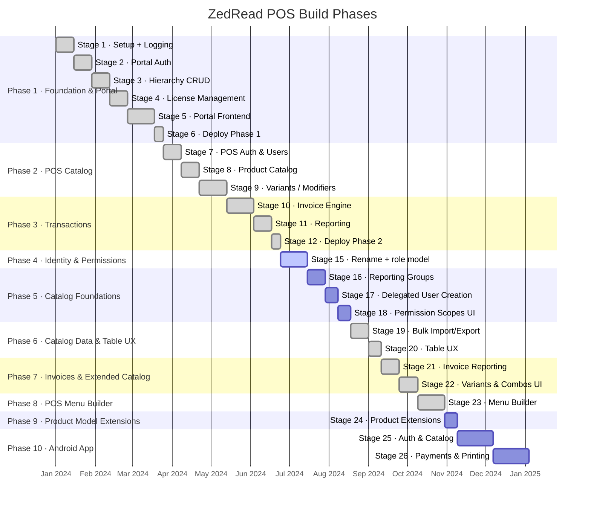

# ZedRead POS — Roadmap

This document tracks the ten-phase build plan. For detailed per-stage status, see [STAGE_STATUS.md](STAGE_STATUS.md).

---

## Phase Overview



Stages 13–14 (previously the Android phase's numbers) are retired — the Android phase is renumbered
to Stages 25–26 to make room for the catalog/reporting/permissions work in Stages 16–24, which was
planned after Stage 15 was already underway.

---

## Phase 1 — Foundation & Portal ✅

**Goal:** A usable portal that lets resellers onboard customers, create their hierarchy, and manage licenses. First commercial milestone.

| Stage | Summary | Key outcome |
|-------|---------|-------------|
| 1 | Project setup, logging, audit table | Test harness, structlog, `log_action()`, Docker |
| 2 | Portal auth | JWT, Argon2, bootstrap CLI |
| 3 | Hierarchy CRUD API | Groups/brands/sites with audit logging |
| 4 | License management | Licenses, device registration, Celery nightly expiry |
| 5 | React portal | All management pages, mobile-responsive |
| **6** | **Deploy Phase 1** | **Portal live on Railway** |

**Exit criteria:** A super admin can log in, create a Group → Brand → Site tree, assign a license, and view the portal on a mobile device.

---

## Phase 2 — POS Catalog ✅

**Goal:** Build the complete product catalog infrastructure so sites have a menu to sell from. Includes the POS authentication system used by terminal staff.

| Stage | Summary | Key outcome |
|-------|---------|-------------|
| 7 | POS auth, PIN, access profiles, grants | Staff can log in to a terminal; permissions enforced |
| 8 | Products, categories, tax, photos | Brand catalog fully configurable |
| **9** | **Variants, modifiers, combos** | **Advanced product features; circular reference protection** |

**Exit criteria:** A brand manager can build a complete menu with variants (size, flavour), modifier groups (extra toppings), combos (meal deals), and tax rules.

> **Descoped (2026-07):** Per-site price/availability overrides (`site_product_overrides`,
> `site_variant_overrides`, the `product_resolver` service, and the Site Overrides portal page)
> were removed — the implementation was not right and the feature will be rescoped later.

---

## Phase 3 — Transactions ✅

**Goal:** Complete the transaction engine — from invoice creation through payment, void, refund, and financial reporting.

| Stage | Summary | Key outcome |
|-------|---------|-------------|
| 10 | Invoice engine | Create, add lines, pay, void, refund; split payments |
| 11 | Reporting | 8 PostgreSQL views; scope-enforced API |
| **12** | **Deploy Phase 2** | **Full backend live; all routes tested and deployed** |

**Exit criteria:** A POS terminal can create a sale, take cash + card split payment, void an invoice (Manager only), issue a refund, and a portal user can pull daily sales and tax reports.

---

## Phase 4 — Identity & Permissions Redesign 🚧

**Goal:** Rename Portal User → SuperAdmin and POS User → User, and replace the 4 system access
profiles with the 5-role model. See `ROLE_MODEL.md` for the full design.

| Stage | Summary | Key outcome |
|-------|---------|-------------|
| **15** | **Rename + 5-role model** | SuperAdmin/User rename, per-page permission grants, license gating, cross-identity login |

**Status:** complete. Page catalog, access-profile page permissions, identity-token login flow, and
the portal frontend rename to SuperAdmins/Users are all built. The page-permission management UI
itself shipped in Stage 18.

---

## Phase 5 — Catalog Foundations ✅

**Goal:** Introduce Reporting Groups above Categories, let backend users delegate account creation
within their own scope, and give the Stage 15 permission system its first portal UI.

| Stage | Summary | Key outcome |
|-------|---------|-------------|
| **16** | **Reporting Groups** | Brand-scoped grouping above Categories; default group per brand; required on every Category |
| **17** | **Delegated User Creation** | Site/Brand/Group-scoped users can create Users at or below their own scope and role |
| **18** | **Permission Scopes Portal UI** | First portal UI for access-profile page permissions; reconciles page catalog going forward |

**Status:** complete — see `STAGE_STATUS.md` for detailed deliverables (Stage 17's scope ladder +
role ceiling in `access_grant_service.py` and Master User guard; Stage 18's `AccessProfilesPage.tsx`
permission-scopes UI with its license-gate preview).

**Exit criteria:** A brand admin can create reporting groups, every category belongs to one, a
site-level user can create a new Staff user at their own site (and no higher), and any backend user
can see/toggle which pages a role can access from the portal.

**Full detail:** [`STAGE_PLAN_16-24.md`](STAGE_PLAN_16-24.md) §16–§18.

---

## Phase 6 — Catalog Data & Table UX ✅

**Goal:** Give Products, Categories, and Reporting Groups proper bulk data tooling and table UX.

| Stage | Summary | Key outcome |
|-------|---------|-------------|
| **19** | **Bulk Import/Export (XLSX)** ✅ | Shared import/export service; template + full export; keyed on human-readable `ref` codes; partial-update on import |
| **20** | **Table UX** ✅ | Reporting Group + Category columns on Products; inline edit and filters on all three catalog pages |

**Stage 19 status:** complete — see `STAGE_STATUS.md` for full deliverables. `categories.ref` is now
wired into the ORM/schema alongside the already-wired `products.ref`/`reporting_groups.ref`;
`export_service.py`/`import_service.py` are shared across all three entities and reused by the
`/products`, `/categories`, `/reporting-groups` `export/template`, `export`, and `import` routes.

**Stage 20 status:** complete — see `STAGE_STATUS.md` for full deliverables. Products' Category and
Reporting Group columns are resolved via a join at query time (no denormalization); all three pages
gained a shared `FilterBar` and click-to-edit inline cells; the portal still has no Import/Export UI
entry point for Stage 19's routes, so filtered exports remain a documented gap rather than a Stage 20
deliverable.

**Exit criteria:** A brand manager can export a template, bulk-edit it in Excel, re-import it, and see
the changes reflected immediately in a filterable, inline-editable table.

**Full detail:** [`STAGE_PLAN_16-24.md`](STAGE_PLAN_16-24.md) §19–§20.

---

## Phase 7 — Invoices & Extended Catalog ✅

**Goal:** Make invoices fully reportable and bring Variants/Combos into the portal.

| Stage | Summary | Key outcome |
|-------|---------|-------------|
| **21** | **Invoice Reporting** ✅ | Filtered list + XLSX export, detail view, PDF export, change log (from existing `audit_logs`) |
| **22** | **Variants & Combos Portal Pages** ✅ | Combined Variants/Combos page with `ref` codes, `display_name`, filters, import/export (Modifiers stay inline on the Product page) |

**Stage 21 status:** complete — see `STAGE_STATUS.md` for full deliverables. New `/invoice-reports`
routes (list with date/site/status/amount filters, XLSX export, detail view, PDF export, change log)
sit alongside the untouched transactional engine in `routes/invoices.py`. `create_refund()` was
fixed to also log the refund against the *original* invoice's `entity_id` so the change log shows it.

**Stage 22 status:** complete — see `STAGE_STATUS.md` for full deliverables. `product_variants` and
`product_combo_groups` (the entity a "combo" resolves to — there is no separate Combo table) each
gained a `ref` sequence and `display_name`; combo groups also gained `is_active` to match variants'
existing soft-delete flag. New brand-wide `GET /variants`/`GET /combos` (joined to their parent
product) back a combined `VariantsCombosPage.tsx` with filters, inline edit, status toggle, and
import/export via Stage 19's shared services.

**Exit criteria:** A portal user can filter invoices, export the filtered set to XLSX, open one
invoice to see its full history of refunds/edits, print a PDF copy, and manage variants and combos
from their own portal page with the same table UX as Products.

**Full detail:** [`STAGE_PLAN_16-24.md`](STAGE_PLAN_16-24.md) §21–§22.

---

## Phase 8 — POS Menu Builder ✅

**Goal:** A graphical POS menu layout tool (tabs of product buttons) that publishes to the Android app.

| Stage | Summary | Key outcome |
|-------|---------|-------------|
| **23** | **Menu Builder Prototype** ✅ | `menu_layouts`/`menu_tabs`/`menu_buttons`, buttons reference products by code, publish pipeline |

**Stage 23 status:** complete — see `STAGE_STATUS.md` for full deliverables. New `menu_layouts`/
`menu_tabs`/`menu_buttons` tables (migration `0040`) back a `menu_builder_service.py` + a new
`/menu-layouts` router (management CRUD, reorder, publish/unpublish) and a `/pos/menu-layout?site_id=`
read contract for Android to eventually consume. Portal gained a `MenuBuilderPage.tsx` (layout list +
a tabs/buttons builder view using native HTML5 drag-and-drop — no new dependency), reachable from the
management nav and as a new tab on the SuperAdmin's Brand detail page.

**Exit criteria:** A brand manager can build a single-level tab/button menu layout referencing
existing products by code and publish it; more than one layout can be published at once (e.g. per
site or day-part).

**Full detail:** [`STAGE_PLAN_16-24.md`](STAGE_PLAN_16-24.md) §23.

---

## Phase 9 — Product Model Extensions ✅

**Goal:** Close out the remaining product-field asks ahead of Android.

| Stage | Summary | Key outcome |
|-------|---------|-------------|
| **24** | **Product Extensions** | Product code surfaced from dormant `ref` column, `print_name`, open item (flexible price/name with permission + price ceiling) |

**Exit criteria:** Every product shows its code in the table and via import/export; a print name is
settable independent of the sale name; an "open item" product can be flagged, permissioned, and
price-limited.

**Full detail:** [`STAGE_PLAN_16-24.md`](STAGE_PLAN_16-24.md) §24.

---

## Phase 10 — Android App 🚧

**Goal:** Deliver the complete Android POS application using the fully-built backend. This is the commercially shippable end product.

| Stage | Summary | Key outcome |
|-------|---------|-------------|
| **25** | **Auth & Catalog** | Login, PIN, site selector, product grid, cart |
| **26** | **Payments & Printing** | Payments, docket printing, switch user, inline auth |

### Stage 25 — Android Auth & Catalog

**What gets built:**

```
Login screen
  └─► PIN entry screen
        └─► Site selector (multi-site users)
              └─► Product grid (category tabs + product tiles)
                    └─► Cart (line items, modifiers, quantity, discount)
```

- Retrofit client wired to backend `/auth/pos/*` and `/products`, `/categories`, `/invoices`
- Room local cache for the catalog (product browsing survives brief connectivity loss)
- Hilt DI modules for network layer, Room DB, and repositories
- Jetpack Compose navigation via `PosNavHost.kt`

**Screens scaffolded:** `auth/`, `cart/`, `catalog/`, `switchuser/`

### Stage 26 — Android Payments & Printing

**What gets built:**

```
Cart screen
  └─► Payment screen (cash / card / voucher / split)
        └─► Success → receipt / docket print
              └─► Back to idle (or switch user)
```

- Cash tender: show change due; call `POST /invoices/{id}/pay`
- Card tender: display reference input; POST with `method=card`
- Voucher: POST with `method=voucher`, reference = voucher code
- Split payment: multiple POST calls; invoice stays `open` until covered
- Docket printing: `printing/` module (Bluetooth thermal printer integration)
- Switch user: PIN re-entry without full logout; returns new JWT for same site
- End-of-day: summary screen pulling `vw_daily_sales` for the shift

---

## Post-Phase 10 Considerations

The following items are outside the current 26-stage plan. They are **not committed** but are worth tracking for prioritisation.

| Item | Why it matters |
|------|---------------|
| Accounting integration | Refund invoices create no journal entries today; an integration with Xero or QuickBooks would close the loop |
| Offline-first sync | Android Room cache provides read-only offline browsing; a full write-queue sync strategy is not yet designed |
| Push notifications | License expiry warnings to portal users |
| Multi-currency | Schema supports `_cents` with an implied currency; no currency field or FX rate table exists yet |
| Kitchen Display System (KDS) | WebSocket push of new invoice lines to a kitchen screen |
| Loyalty / customer accounts | `ROLE_MODEL.md` already reserves a "Customers & Loyalty" permission category, but no customer table exists yet — the permission category is ahead of the schema |
| Tax compound edge cases | PST-on-GST compound stacking not validated against real-world AU/CA tax rules |
| Production docket printing | Stage 24 adds `print_name`, but the docket printing feature itself is out of scope until scheduled |
