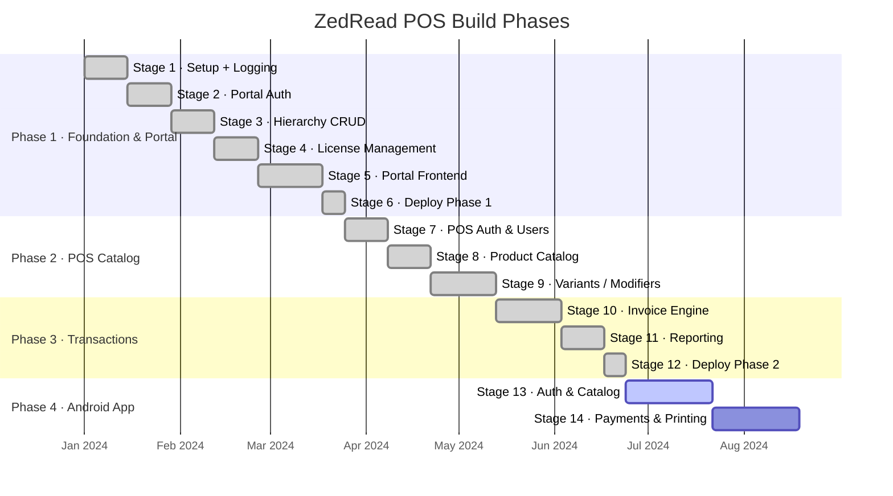

# ZedRead POS — Roadmap

This document tracks the four-phase build plan. For detailed per-stage status, see [STAGE_STATUS.md](STAGE_STATUS.md).

---

## Phase Overview



---

## Phase 1 — Foundation & Portal ✅

**Goal:** A usable portal that lets resellers onboard customers, create their hierarchy, and manage licenses. First commercial milestone.

| Stage | Summary | Key outcome |
|-------|---------|-------------|
| 1 | Project setup, logging, audit table | Test harness, structlog, `log_action()`, Docker |
| 2 | Portal auth | JWT, Argon2, bootstrap CLI |
| 3 | Hierarchy CRUD API | Groups/brands/sites with audit logging |
| 4 | License management | Licenses, device registration, Celery nightly expiry |
| 5 | React portal | All management pages, mobile-responsive |
| **6** | **Deploy Phase 1** | **Portal live on Railway** <!-- TODO: verify hosting — README says Vercel but pos-portal/railway.toml exists --> |

**Exit criteria:** A super admin can log in, create a Group → Brand → Site tree, assign a license, and view the portal on a mobile device.

---

## Phase 2 — POS Catalog ✅

**Goal:** Build the complete product catalog infrastructure so sites have a menu to sell from. Includes the POS authentication system used by terminal staff.

| Stage | Summary | Key outcome |
|-------|---------|-------------|
| 7 | POS auth, PIN, access profiles, grants | Staff can log in to a terminal; permissions enforced |
| 8 | Products, categories, tax, site overrides, photos | Brand catalog fully configurable |
| **9** | **Variants, modifiers, combos** | **Advanced product features; circular reference protection** |

**Exit criteria:** A brand manager can build a complete menu with variants (size, flavour), modifier groups (extra toppings), combos (meal deals), tax rules, and per-site price overrides.

---

## Phase 3 — Transactions ✅

**Goal:** Complete the transaction engine — from invoice creation through payment, void, refund, and financial reporting.

| Stage | Summary | Key outcome |
|-------|---------|-------------|
| 10 | Invoice engine | Create, add lines, pay, void, refund; split payments |
| 11 | Reporting | 8 PostgreSQL views; scope-enforced API |
| **12** | **Deploy Phase 2** | **Full backend live; all routes tested and deployed** |

**Exit criteria:** A POS terminal can create a sale, take cash + card split payment, void an invoice (Manager only), issue a refund, and a portal user can pull daily sales and tax reports.

---

## Phase 4 — Android App 🚧

**Goal:** Deliver the complete Android POS application using the fully-built backend. This is the commercially shippable end product.

| Stage | Summary | Key outcome |
|-------|---------|-------------|
| **13** | **Auth & Catalog** | Login, PIN, site selector, product grid, cart |
| **14** | **Payments & Printing** | Payments, docket printing, switch user, inline auth |

### Stage 13 — Android Auth & Catalog

**What gets built:**

```
Login screen
  └─► PIN entry screen
        └─► Site selector (multi-site users)
              └─► Product grid (category tabs + product tiles)
                    └─► Cart (line items, modifiers, quantity, discount)
```

- Retrofit client wired to backend `/auth/pos/*` and `/products`, `/categories`, `/invoices`
- Room local cache for the catalog (product browsing survives brief connectivity loss)
- Hilt DI modules for network layer, Room DB, and repositories
- Jetpack Compose navigation via `PosNavHost.kt`

**Screens scaffolded:** `auth/`, `cart/`, `catalog/`, `switchuser/`

### Stage 14 — Android Payments & Printing

**What gets built:**

```
Cart screen
  └─► Payment screen (cash / card / voucher / split)
        └─► Success → receipt / docket print
              └─► Back to idle (or switch user)
```

- Cash tender: show change due; call `POST /invoices/{id}/pay`
- Card tender: display reference input; POST with `method=card`
- Voucher: POST with `method=voucher`, reference = voucher code
- Split payment: multiple POST calls; invoice stays `open` until covered
- Docket printing: `printing/` module (Bluetooth thermal printer integration)
- Switch user: PIN re-entry without full logout; returns new JWT for same site
- End-of-day: summary screen pulling `vw_daily_sales` for the shift

---

## Post-Phase 4 Considerations

The following items are outside the current 14-stage plan. They are **not committed** but are worth tracking for prioritisation.

| Item | Why it matters |
|------|---------------|
| Accounting integration | Refund invoices create no journal entries today; an integration with Xero or QuickBooks would close the loop |
| Offline-first sync | Android Room cache provides read-only offline browsing; a full write-queue sync strategy is not yet designed |
| Push notifications | License expiry warnings to portal users |
| Multi-currency | Schema supports `_cents` with an implied currency; no currency field or FX rate table exists yet |
| Kitchen Display System (KDS) | WebSocket push of new invoice lines to a kitchen screen |
| Loyalty / customer accounts | No customer table exists today |
| Tax compound edge cases | PST-on-GST compound stacking not validated against real-world AU/CA tax rules |

<!-- TODO: verify which of these are covered in pos_master_v5.docx later chapters -->
